# 🍔 FoodieStore

FoodieStore is a full-stack online food ordering web application where users can browse restaurants, view menus, filter and sort food items, add food items to their cart, place orders, view order history, and manage their profile.

---

# 📌 Project Overview

FoodieStore is designed to provide a simple and user-friendly online food ordering experience.

The application is developed using Java, JSP, Servlets, JDBC, MySQL, HTML, CSS and JavaScript.

The project follows the **MVC architecture** and uses the **DAO design pattern** for database operations.

The shopping cart is managed using **HTTP Session and HashMap**, while completed orders are stored in the MySQL database.

---

# 🚀 Features

## 🔐 User Authentication

- User Registration
- User Login
- User Logout
- Session Management
- Password Hashing
- User Profile Management

## 🍽️ Restaurant Module

Users can browse available restaurants and view restaurant information such as:

- Restaurant Name
- Restaurant Rating
- Address
- Estimated Delivery Time
- Restaurant Image

### Restaurant Sorting

Restaurants can be sorted using:

- Name - Ascending
- Name - Descending
- Rating - Ascending
- Rating - Descending

The sorting functionality is implemented using Java `Comparator`.

---

## 🍕 Menu Module

Users can select a restaurant and view its available food items.

Each menu item contains information such as:

- Food Name
- Description
- Price
- Availability
- Cuisine Type
- Food Image

### Menu Filtering

Users can filter food items based on:

- Veg
- Non-Veg

### Menu Sorting

Menu items can be sorted based on:

- Price - Ascending
- Price - Descending

The sorting functionality is implemented using Java `Comparator`.


# 🛒 Cart Management

The shopping cart is maintained using **HTTP Session and HashMap**.

The cart is not stored as a separate table in the database.

### Cart Workflow

```text
Menu Page
    ↓
Select Food Item
    ↓
Add to Cart
    ↓
Cart Servlet
    ↓
HashMap<Integer, CartItem>
    ↓
HTTP Session
    ↓
Cart Page
```
Cart Features
Add food items
Increase quantity
Decrease quantity
Remove food items
Calculate item total
Calculate cart grand total

The HashMap is used to maintain cart items during the user's session.

💳 Checkout
```
Cart
 ↓
Checkout Page
 ↓
Review Order
 ↓
Confirm Order
 ↓
Create Order
 ↓
Create Order Items
 ↓
Store in MySQL
```
📦 Order Management

Users can:

Place orders
View placed orders
View order history
View individual order details
```
Cart
 ↓
Checkout
 ↓
Order
 ↓
Order Items
 ↓
MySQL Database
 ↓
Order History
```
👤 Profile Management
```
User
 ↓
Profile Page
 ↓
Profile Servlet
 ↓
User DAO
 ↓
MySQL Database
 ↓
Updated Profile
```

🛠️ Technologies Used
1 Frontend
HTML5
CSS3
JavaScript
JSP

2 Backend
Java
Jakarta Servlets
JDBC
DAO Pattern
MVC Architecture

3 Database
MySQL

4 Server
Apache Tomcat 10.1

5 Development Tools
Eclipse IDE
MySQL
Git
GitHub

6 Security
BCrypt Password Hashing
HTTP Session Management

MVC Components

Model

Contains Java classes representing application data.

Examples:

User
Restaurant
Menu
CartItem
Order
OrderItem

View

The View layer contains JSP pages responsible for displaying the user interface.

Controller

Servlets handle HTTP requests and control the application flow.

DAO

DAO interfaces and implementations handle database operations.

📂 Project Structure
```
FoodieStore
│
├── Screenshots
│   ├── cart.png
│   ├── checkout.png
│   ├── home.png
│   ├── login.png
│   ├── menu.png
│   ├── orderConfirmation.png
│   ├── orderDetails.png
│   ├── orderHistory.png
│   ├── profile.png
│   ├── register.png
│   └── restaurant.png
│
├── src/main/java
│   └── com.FoodieStore
│
│       ├── comparator
│       │   ├── NameComparatorAscending
│       │   ├── NameComparatorDescending
│       │   ├── RatingsComparatorASC
│       │   ├── RatingsComparatorDSC
│       │   ├── MenuPriceComparatorASC
│       │   └── MenuPriceComparatorDSC
│       │
│       ├── DAO
│       │   ├── UserDAO
│       │   ├── RestaurantDAO
│       │   ├── MenuDAO
│       │   └── OrderDAO
│       │
│       ├── DAOimpl
│       │   ├── UserDAOimpl
│       │   ├── RestaurantDAOimpl
│       │   ├── MenuDAOimpl
│       │   └── OrderDAOimpl
│       │
│       ├── Model
│       │   ├── User
│       │   ├── Restaurant
│       │   ├── Menu
│       │   ├── Cart
│       │   ├── CartItem
│       │   ├── Order
│       │   └── OrderItem
│       │
│       ├── Servlets
│       │   ├── LoginServlet
│       │   ├── RegisterServlet
│       │   ├── RestaurantServlet
│       │   ├── MenuServlet
│       │   ├── CartServlet
│       │   ├── OrderServlet
│       │   └── ProfileServlet
│       │
│       └── Utility
│           └── Database Connection / Utility Classes
│
├── src/main/webapp
│   ├── images
│   ├── MenuImages
│   ├── META-INF
│   ├── WEB-INF
│   │
│   ├── index.jsp
│   ├── home.jsp
│   ├── login.jsp
│   ├── register.jsp
│   ├── menu.jsp
│   ├── cart.jsp
│   ├── checkout.jsp
│   ├── order.jsp
│   ├── orderDetails.jsp
│   ├── orderHistory.jsp
│   └── profile.jsp
│
└── build
```
📦 Package Description
```
| Package      | Purpose                                                   |
| ------------ | --------------------------------------------------------- |
| `Model`      | Contains Java model classes representing application data |
| `DAO`        | Contains DAO interfaces for database operations           |
| `DAOimpl`    | Contains implementations of DAO interfaces                |
| `Servlets`   | Handles HTTP requests and controls application flow       |
| `comparator` | Contains Comparator classes used for sorting              |
| `Utility`    | Contains database connection and utility classes          |
| `webapp`     | Contains JSP pages, images and web resources              |
```
1️⃣ User Registration
```
User
 ↓
Register Page
 ↓
Register Servlet
 ↓
User DAO
 ↓
MySQL Database
 ↓
Account Created
```
2️⃣ User Login
```
User
 ↓
Login Page
 ↓
Login Servlet
 ↓
User DAO
 ↓
Validate Credentials
 ↓
Create HTTP Session
 ↓
Home Page
```
3️⃣ Browse Restaurants
```
Home Page
 ↓
Restaurant Servlet
 ↓
Restaurant DAO
 ↓
MySQL Database
 ↓
Restaurant List
 ↓
Display Restaurants

Restaurant Sorting

Restaurants
     ↓
Sort Option
     ↓
 ┌───────────────────────┐
 │ Name Ascending        │
 │ Name Descending       │
 │ Rating Ascending      │
 │ Rating Descending     │
 └───────────────────────┘
     ↓
Sorted Restaurant List
```
Java Comparator classes are used to perform the sorting.
```
4️⃣ View Menu

Select Restaurant
 ↓
Menu Servlet
 ↓
Menu DAO
 ↓
MySQL Database
 ↓
Menu Items
 ↓
Menu Page
```
5️⃣ Menu Filtering and Sorting
Users can filter menu items by food type.
```
Menu
 ↓
Filter
 ├── VEG
 └── NON-VEG
```
Users can also sort menu items based on price.
```
Menu
 ↓
Sort by Price
 ├── Price Ascending
 └── Price Descending
```
Java Comparator classes are used for price sorting.

6️⃣ Add Items to Cart
```
Menu Page
 ↓
Add Food Item
 ↓
Cart Servlet
 ↓
HashMap
 ↓
HTTP Session
 ↓
Cart Page
```

### 🛒 Cart Management

The shopping cart is maintained using **HTTP Session and HashMap**.

The `Cart` class manages the session-based cart, while `CartItem` represents each food item added to the cart.

```text
HTTP Session
      ↓
     Cart
      ↓
HashMap<Integer, CartItem>
      ↓
  Cart Items
```

The menu/food item ID is used as the key and the corresponding CartItem is stored as the value.

7️⃣ Checkout
```
Cart
 ↓
Checkout Page
 ↓
Review Items
 ↓
Confirm Order
 ↓
Order Servlet
 ↓
Create Order
 ↓
Create Order Items
 ↓
MySQL Database
```
8️⃣ Order History
```
User
 ↓
Order History
 ↓
Order History Servlet
 ↓
Order DAO
 ↓
MySQL Database
 ↓
Display Orders
```
9️⃣ Profile Management
```
User
 ↓
Profile Page
 ↓
Profile Servlet
 ↓
User DAO
 ↓
MySQL Database
 ↓
Updated Profile
```
🗄️ Database Design

FoodieStore uses MySQL for persistent application data.
```
| Table        | Purpose                                       |
| ------------ | --------------------------------------------- |
| `users`      | Stores user account and profile information   |
| `restaurant` | Stores restaurant information                 |
| `menu`       | Stores menu/food item information             |
| `orders`     | Stores placed order information               |
| `orderitem`  | Stores individual items belonging to an order |

              USER
                │
                │
                ▼
             ORDERS
                │
                │
                ▼
           ORDERITEM
                │
                │
                ▼
           MENU ITEMS


         RESTAURANT
              │
              │
              ▼
             MENU
```
Cart

The cart is handled separately using:

HTTP Session
      +
HashMap
      +
CartItem
Therefore, the cart does not require a separate persistent cart table.

# 🖥️ User Interface

FoodieStore provides a simple and user-friendly interface for different stages of the food ordering process.

## 🔐 Login Page

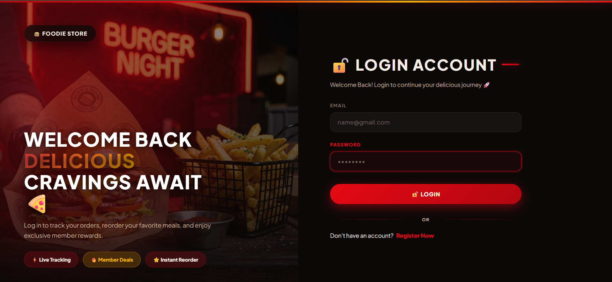

The login page allows registered users to securely log in to the application.

---

## 📝 Registration Page

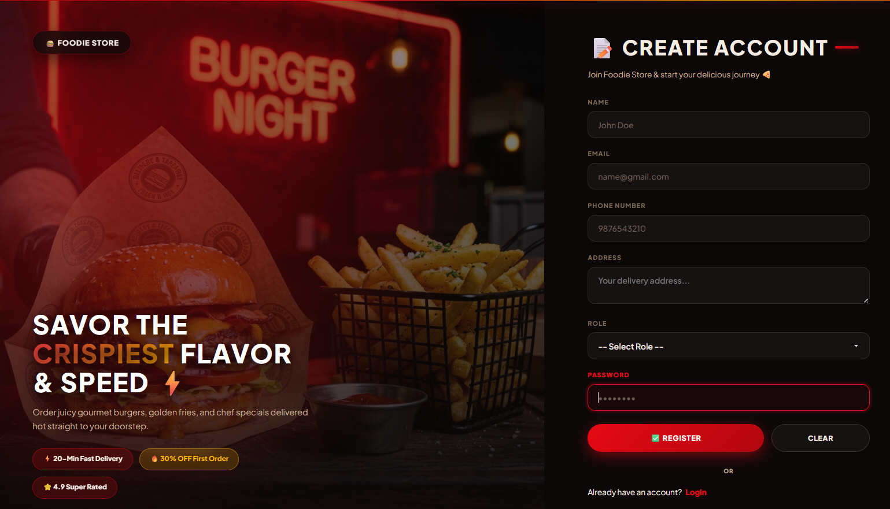

New users can create an account by providing their required details.

---

## 🏠 Home Page

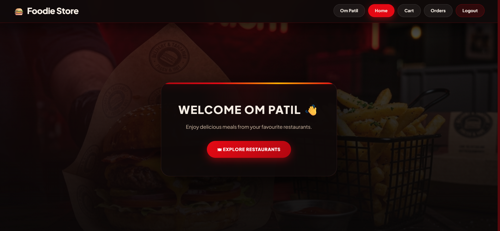

---

## 🍽️ Restaurant Page

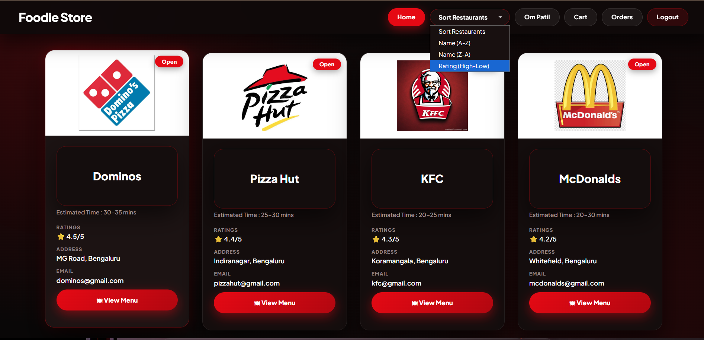

Users can select a restaurant and view its available menu items.
The home page displays the available restaurants along with restaurant information.

Users can sort restaurants by:

- Name - Ascending
- Name - Descending
- Rating - Ascending
- Rating - Descending

---

## 🍕 Menu Page

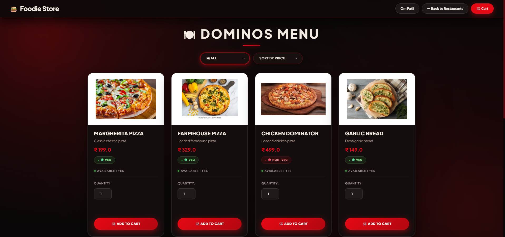

The menu page displays the food items available in the selected restaurant.

Users can:

- Filter Veg items
- Filter Non-Veg items
- Sort by Price - Ascending
- Sort by Price - Descending
- Add items to the cart

---

## 🛒 Cart Page

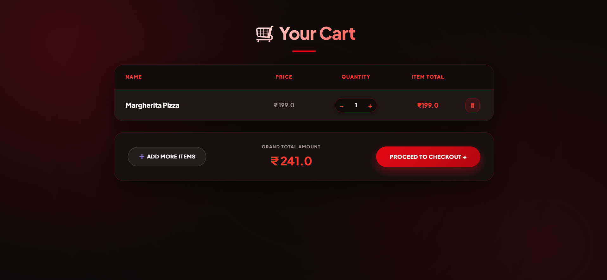

The cart displays the food items selected by the user.

Users can:

- Increase quantity
- Decrease quantity
- Remove items
- View item totals
- View the grand total

The cart is maintained using **HashMap and HTTP Session**.

---

## 💳 Checkout Page

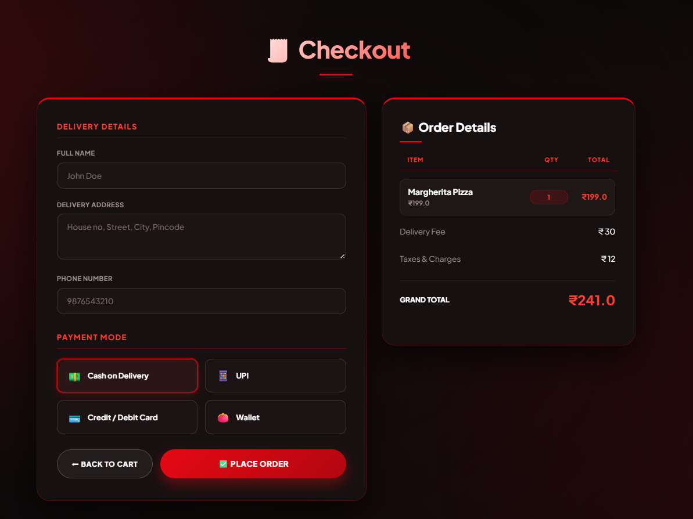

Users can review their selected items before placing the order.

---

## ✅ Order Confirmation

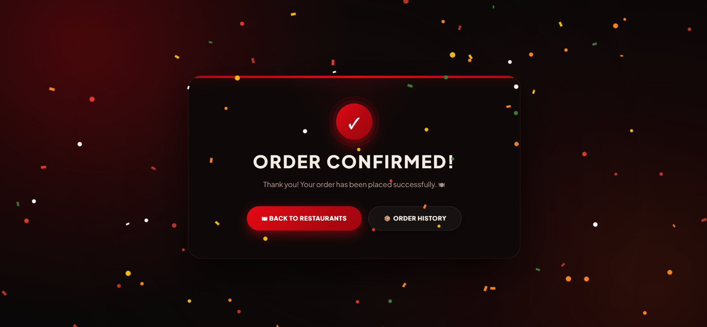

After successfully placing an order, the user receives an order confirmation.

---

## 📦 Order History

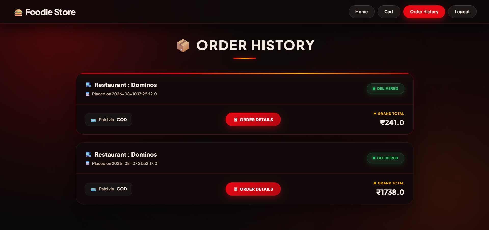

Users can view their previously placed orders.

---

## 📋 Order Details

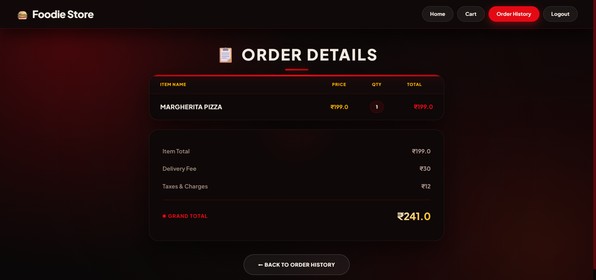

Users can select an order and view detailed information about the order and its items.

---

## 👤 Profile Page

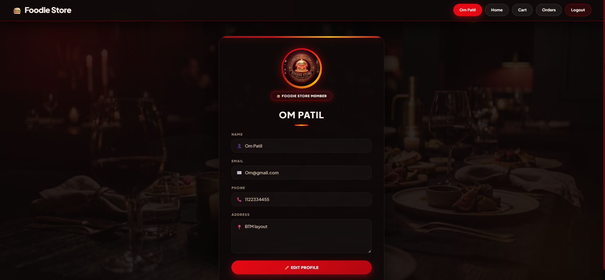

Users can view and update their profile information.

---

# 🗄️ Database Design

FoodieStore uses **MySQL** for persistent application data.

## Main Tables

| Table | Purpose |
|---|---|
| `users` | Stores user account and profile information |
| `restaurant` | Stores restaurant information |
| `menu` | Stores menu and food item information |
| `orders` | Stores placed order information |
| `orderitem` | Stores individual food items belonging to an order |

### Database Relationship

```text
              USER
                │
                ▼
             ORDERS
                │
                ▼
           ORDERITEM
                │
                ▼
              MENU


         RESTAURANT
              │
              ▼
             MENU
```
🔐 Security

The application implements basic security mechanisms including:

User authentication
Password hashing using BCrypt
HTTP Session management
Login validation
Session-based user identification

Passwords are stored in hashed form rather than plain text.

🧠 Java Concepts Implemented
This project demonstrates several Java concepts:

Object-Oriented Programming
Encapsulation
Interfaces
Collections
HashMap
Comparator
DAO Pattern
MVC Architecture
Exception Handling
JDBC
Servlets
JSP
HTTP Sessions

Comparator Implementation
```
Restaurant
 ├── Name Ascending
 ├── Name Descending
 ├── Rating Ascending
 └── Rating Descending

Menu
 ├── Price Ascending
 └── Price Descending
```
🚀 Future Enhancements

Possible future improvements include:

Online Payment Integration
Admin Dashboard
Restaurant Owner Dashboard
Delivery Partner Module
Real-time Order Tracking
Email Notifications
Mobile Responsive UI
Food Recommendation System
Restaurant Search
Location-Based Restaurant Search

👨‍💻 Developer

Om Patil

BE - Computer Science and Engineering

⭐ If you like this project, consider giving the repository a star!


**So just paste this immediately after your existing `Package Description` section.** Your scree


